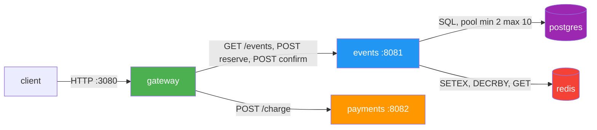

# Lab 1. SRE philosophy: deploy, break, understand

Kirill Fadeev
ki.fadeev@innopolis.university

Environment: Docker 29.6.1, Compose v5.3.1, WSL2 kernel 6.18.33.2 on Windows.

---

## Task 1. Deploy and break QuickTicket

### 1.1 Deployment

```bash
cd app/
docker compose up --build -d
docker compose ps
```

```plaintext
NAME             IMAGE                COMMAND                  SERVICE    CREATED          STATUS                    PORTS
app-events-1     app-events           "uvicorn main:app --…"   events     42 seconds ago   Up 34 seconds             0.0.0.0:8081->8081/tcp, [::]:8081->8081/tcp
app-gateway-1    app-gateway          "uvicorn main:app --…"   gateway    41 seconds ago   Up 33 seconds             0.0.0.0:3080->8080/tcp, [::]:3080->8080/tcp
app-payments-1   app-payments         "uvicorn main:app --…"   payments   42 seconds ago   Up 41 seconds             0.0.0.0:8082->8082/tcp, [::]:8082->8082/tcp
app-postgres-1   postgres:17-alpine   "docker-entrypoint.s…"   postgres   42 seconds ago   Up 41 seconds (healthy)   0.0.0.0:5432->5432/tcp, [::]:5432->5432/tcp
app-redis-1      redis:7-alpine       "docker-entrypoint.s…"   redis      42 seconds ago   Up 41 seconds (healthy)   0.0.0.0:6379->6379/tcp, [::]:6379->6379/tcp
```

Five containers, and only two of them carry a healthcheck. The three application services report `Up` with no health verdict at all, which is the first observation of the lab: the runtime says the process exists, and that is a different claim from the service being able to serve traffic.

### 1.2 The critical path works

```bash
curl -s http://localhost:3080/events | python3 -m json.tool
```

```plaintext
[
    {
        "id": 1,
        "name": "Go Conference 2026",
        "venue": "Main Hall A",
        "date": "2026-09-15T09:00:00+00:00",
        "total_tickets": 100,
        "price_cents": 5000,
        "available": 100
    },
    ...
    {
        "id": 3,
        "name": "Cloud Native Summit",
        "venue": "Expo Center",
        "date": "2026-11-20T10:00:00+00:00",
        "total_tickets": 500,
        "price_cents": 15000,
        "available": 500
    }
]
```

```bash
curl -s -X POST http://localhost:3080/events/1/reserve \
  -H "Content-Type: application/json" -d '{"quantity": 2}' | python3 -m json.tool
```

```plaintext
{
    "reservation_id": "bb220456-8f8a-492b-8eb8-0ad7f27cae87",
    "event_id": 1,
    "quantity": 2,
    "total_cents": 10000,
    "expires_in_seconds": 300
}
```

```bash
curl -s -X POST http://localhost:3080/reserve/bb220456-8f8a-492b-8eb8-0ad7f27cae87/pay | python3 -m json.tool
```

```plaintext
{
    "order_id": "bb220456-8f8a-492b-8eb8-0ad7f27cae87",
    "event_id": 1,
    "quantity": 2,
    "total_cents": 10000,
    "status": "confirmed"
}
```

```bash
curl -s http://localhost:3080/health | python3 -m json.tool
```

```plaintext
{
    "status": "healthy",
    "checks": {
        "events": "ok",
        "payments": "ok",
        "circuit_payments": "CLOSED"
    }
}
```

Availability for event 1 goes from 100 to 98 after the order is confirmed, so the write path really lands in Postgres.

### 1.3 Architecture and dependency map



What each edge actually carries:

| Edge | Used by | What breaks without it |
|---|---|---|
| gateway to events | every endpoint except `/health` and `/metrics` | the whole product |
| gateway to payments | `POST /reserve/{id}/pay` only | payment, not browsing or reserving |
| events to postgres | catalogue reads, availability, order insert | catalogue and orders |
| events to redis | reservation records with a 300 second TTL, the `held` counter | reserving and confirming |

Three details in the code decide most of the behaviour below.

The pay handler charges before it confirms:

```python
    pay_resp = await payments_cb.call(lambda: call_with_retry(_charge, target="payments"))
    ...
    confirm_resp = await client.post(f"{EVENTS_URL}/reservations/{reservation_id}/confirm", ...)
```

The gateway health check only asks its immediate neighbours, and gives itself two seconds:

```python
    for name, url in (("events", EVENTS_URL), ("payments", PAYMENTS_URL)):
        try:
            r = await client.get(f"{url}/health", timeout=2)
            checks[name] = "ok" if r.status_code == 200 else "degraded"
        except Exception:
            checks[name] = "down"
```

And the events service caches its Redis verdict, stamping the cache as fresh before the probe has returned:

```python
    if now - _redis_checked_at < _REDIS_CHECK_INTERVAL:
        return _redis_ok
    _redis_checked_at = now
    ...
    _redis_ok = redis_client.ping()
```

### 1.4 Systematic failure exploration

For each component I stopped the container, waited eight seconds, then sent the same five probes: list events, reserve, pay against a reservation created while the system was healthy, gateway health, and the events health endpoint directly. Status codes and wall time come from `curl -w`.

| Component killed | Events list | Reserve | Pay | Health check | User impact |
|---|---|---|---|---|---|
| `payments` | 200 in 12 ms | 200 in 9 ms | **504 after 5.009s** | gateway 503 after 2.012s, `payments: down`; events `healthy` | Browsing and reserving unaffected. Payment hangs for five seconds and then fails with a timeout that tells the user nothing. |
| `events` | **504 after 5.007s** | **504 after 5.007s** | **500 after 5.010s**, money already charged | gateway 503 after 2.022s, `events: down`; events unreachable | Full outage, every request hangs the full timeout first, and a charge lands with no order behind it. |
| `redis` | 200 in 9 ms | **504 after 5.008s** | **500 after 5.012s**, money already charged | gateway 503, `events: down`; events itself answers **200 `redis: ok`** in 3 ms | Catalogue browsable, nothing reservable, and the health endpoint of the broken service reports it as healthy. |
| `postgres` | **502 in 8 ms** | **502 in 6 ms** | **500 in 13 ms**, money already charged | gateway 503 after 2.191s, `events: down`; events **503 after 15.257s**, `postgres: down` | Full outage. The endpoints fail in milliseconds while the health check takes fifteen seconds. |

The first thing this table says is about the failure mode of the platform, not the application. On this host, a dockerd running inside WSL2, the packets sent to a stopped container are dropped rather than refused, so a dead dependency does not produce a connection error. It produces silence, and the caller sits there until its own timeout expires. Three of the four components fail as `504` at exactly 5.007 to 5.012 seconds, which is `GATEWAY_TIMEOUT_MS=5000` plus the round trip. A dead service and a very slow service are indistinguishable from the outside.

**payments stopped.** The blast radius is exactly the one edge that uses it.

```plaintext
GET /events                    HTTP 200  (0.012344s)
POST /events/1/reserve         HTTP 200  (0.009321s)
POST /reserve/{id}/pay         HTTP 504  (5.008962s)
   body: {"detail":"Payment service timeout"}
GET /health (gateway)          HTTP 503  (2.012406s)
   body: {"status":"degraded","checks":{"events":"ok","payments":"down","circuit_payments":"CLOSED"}}
GET /health (events:8081)      HTTP 200  (0.003332s)
```

> The reservation lives in Redis for 300 seconds and is untouched, but the API makes the user wait five seconds and then answers with a bare timeout. The system is in a recoverable state and reports it as an unexplained failure. This is what Task 2 fixes.

**events stopped.** This is the expensive failure.

```plaintext
GET /events                    HTTP 504  (5.007008s)
POST /events/1/reserve         HTTP 504  (5.006900s)
POST /reserve/{id}/pay         HTTP 500  (5.010090s)
   body: {"detail":"Payment succeeded but confirmation failed — contact support"}
GET /health (events:8081)      HTTP 000  (0.000187s)
```

> The charge happens before the confirmation, so a dependency that has nothing to do with money still takes the user's money. The error message is honest and the system has no way to make it right: there is no compensating refund, no outbox, no idempotency key. The blast radius of `events` is not the catalogue, it is the catalogue plus the wallet. Note the last line: the events port is not listening at all, so `curl` fails to connect in 0.2 ms. The only component that fails fast is the one that is completely gone.

**redis stopped.** The most misleading of the four.

```plaintext
GET /events                    HTTP 200  (0.009373s)
POST /events/1/reserve         HTTP 504  (5.007922s)
POST /reserve/{id}/pay         HTTP 500  (5.011996s)
GET /health (gateway)          HTTP 503  (2.011316s)
   body: {"status":"degraded","checks":{"events":"down","payments":"ok","circuit_payments":"CLOSED"}}
GET /health (events:8081)      HTTP 200  (0.003014s)
   body: {"status":"healthy","checks":{"postgres":"ok","redis":"ok"}}
```

Listing events survives, because `list_events` answers from SQL alone. Reserving burns the full gateway timeout. And the events service, whose Redis is gone, reports itself healthy with `redis: ok` in three milliseconds.

> That last line is a health check lying at the exact moment it matters. `_check_redis` stamps `_redis_checked_at = now` before it knows the result of the ping, so while the first probe hangs on the dead connection, every other request inside that five second window reads the previous `True`. The endpoint is a sync handler served from a thread pool, so those concurrent requests are the normal case, not a corner case. Meanwhile the gateway, whose probe has a two second budget, labels the same service `down` rather than `degraded`. One broken dependency produces two different verdicts, and neither of them names Redis.

**postgres stopped.** Same outage class, opposite timing profile.

```plaintext
GET /events                    HTTP 502  (0.007648s)
POST /events/1/reserve         HTTP 502  (0.005906s)
POST /reserve/{id}/pay         HTTP 500  (0.013419s)
GET /health (gateway)          HTTP 503  (2.191318s)
   body: {"status":"degraded","checks":{"events":"down","payments":"ok","circuit_payments":"CLOSED"}}
GET /health (events:8081)      HTTP 503  (15.256859s)
   body: {"status":"degraded","checks":{"postgres":"down","redis":"ok"}}
```

```plaintext
events-1  | psycopg2.InterfaceError: connection already closed
```

The pool already held open connections, so the first query fails immediately on a socket that is already dead. That is why the user facing endpoints answer in six to thirteen milliseconds here while everything else in this lab took five seconds.

> The health endpoint is the slowest thing in the system: 15.26 seconds against 6 milliseconds for the endpoint next to it. It is slow because it asks the pool for a *new* connection, and opening one hangs until the OS gives up, while the application code fails instantly on the connections it already has. A health check that takes fifteen seconds cannot be used by anything: not by a load balancer, not by Kubernetes probes in Lab 4, not by the alerting in Lab 6. The gateway does not wait for it, it times out at two seconds and guesses.

One more observation from reading the code rather than from the output. The gateway's reserve handler builds its error response like this:

```python
    except httpx.HTTPStatusError as e:
        raise HTTPException(e.response.status_code, e.response.json())
```

`.json()` is called on the upstream body inside the `except` block. An upstream 500 with a plain text body, which is exactly what FastAPI returns for an unhandled exception, makes this line raise inside its own handler, and the client then gets a 500 with no JSON at all. In this run the upstream connection dropped before that path was reached, so the generic handler answered 502 instead, but the error path is one non-JSON response away from failing while reporting a failure.

Recovery after each `docker compose start` was automatic in all four cases: the psycopg2 pool reconnects, the Redis client re-resolves, and the gateway reports `healthy` again within 20 seconds without a restart.

### 1.5 Load generator with payments killed mid-flight

Sixty seconds at a target of five requests per second, `payments` stopped at t=20s and started again at t=40s.

```plaintext
QuickTicket Load Generator
Target: http://localhost:3080 | RPS: 5 | Duration: 60s
---
[10s] requests=47 success=47 fail=0 error_rate=0%
[20s] requests=86 success=86 fail=0 error_rate=0%
>>> t=20s: docker compose stop payments
[20s] requests=88 success=87 fail=1 error_rate=1.1%
[20s] requests=89 success=88 fail=1 error_rate=1.1%
 Container app-payments-1 Stopped
>>> t=40s: docker compose start payments
 Container app-payments-1 Started
[50s] requests=133 success=128 fail=5 error_rate=3.7%
[50s] requests=136 success=131 fail=5 error_rate=3.6%
---
Done. total=175 success=170 fail=5 error_rate=2.8%
```

The error rate is the least interesting number here.

Before the outage the generator delivered 89 requests in 20 seconds, about 4.5 per second. Between t=20s and t=50s it delivered 44 requests, about 1.5 per second. The whole payment service was down and only five requests failed, but the system delivered a third of its usual throughput, because every purchase attempt in the mix blocked the generator for the full five second timeout. Roughly four blocked requests consumed two thirds of the capacity of a client that was mostly reading the catalogue.

> A dependency that fails by timing out does not show up as errors, it shows up as capacity. Ten percent of the traffic was broken and about sixty percent of the throughput disappeared. An SLI built on error rate would have reported this incident as 2.8 percent bad and closed the ticket. The number that describes what users felt is latency, and the number that describes what the system did is requests served.

Two smaller things in the same output. The cumulative rate peaks at 3.7 percent and then falls to 2.8 percent while the run is still going, so a dashboard built on totals shows neither the start nor the end of an incident, which is the argument for `rate()` over a short window in Lab 3. And there are no `[30s]` or `[40s]` progress lines at all: the generator prints progress from the same loop that issues the requests, so when the loop is blocked, the reporting is blocked with it. Instrumentation that shares a thread with the work disappears exactly when the work is in trouble.

---

## Task 2. Graceful degradation

### The change

```bash
git diff app/gateway/main.py
```

```diff
@@ -334,6 +334,28 @@ async def pay_reservation(reservation_id: str):
         raise HTTPException(503, "Payment service temporarily unavailable (circuit open)")
+    except (httpx.ConnectError, httpx.ConnectTimeout) as e:
+        # Lab 1 task 2: the request never reached payments, so no charge can
+        # have happened and the reservation is still held in Redis. Degrade
+        # gracefully instead of returning a generic 502 or a bare 504.
+        #
+        # Only CONNECT-stage failures land here. A read timeout stays a 504
+        # below on purpose: there the request was delivered, the charge may
+        # already have gone through, and telling the user to retry could
+        # charge them twice.
+        log.warning(f"payments unreachable at connect stage, degrading: {e!r}")
+        return JSONResponse(
+            status_code=503,
+            content={
+                "error": "payments_unavailable",
+                "message": (
+                    "Payment service is temporarily down. Your reservation is held, "
+                    "try again in a few minutes."
+                ),
+                "reservation_id": reservation_id,
+            },
+            headers={"Retry-After": "30"},
+        )
     except httpx.TimeoutException:
         raise HTTPException(504, "Payment service timeout")
     except httpx.HTTPStatusError as e:
         raise HTTPException(e.response.status_code, "Payment failed")
```

The lab hint suggests catching `httpx.ConnectError`. On this setup that alone would never fire. Section 1.4 showed that a stopped container does not refuse connections here, it swallows the packets, so the failure arrives as `ConnectTimeout` and the pre-existing `except httpx.TimeoutException` above would have answered 504 before any new branch was reached. The branch therefore catches both connect-stage failures and sits above the timeout handler, because `ConnectTimeout` is a subclass of `TimeoutException` and Python takes the first matching handler.

Splitting connect failures from read failures is the part that carries the reliability argument. If the connection was never established, the charge cannot have happened, so promising the user that the reservation is intact is a true statement. If the request was sent and the response never came, the charge may well have gone through, so the same message would invite a second charge on retry. A read timeout stays a 504 for that reason.

`JSONResponse` is returned rather than `HTTPException` raised, because the reservation id has to travel in the body and `HTTPException(detail=...)` would bury it under `detail`.

`Retry-After: 30` is a promise with a limit. Reservations live for `RESERVATION_TTL=300` seconds, so advising a retry in a few minutes is only true inside that window. A production version would compute the remaining TTL and refuse to promise past it.

### Verification

The service is killed rather than stopped, and the reason is worth recording. A graceful `docker compose stop` on this host leaves the container process alive: the container is marked stopped and loses its network alias, but a leftover `docker-proxy` keeps the published port open and the process behind it keeps answering. The first attempt at this verification passed for the wrong reason because of that. The gateway holds a pooled keep-alive connection to payments, and that connection kept working against a service that Docker considered stopped, so payment succeeded and `/health` reported `payments: ok` while `payments` no longer resolved inside the network at all.

> A stopped container and an unreachable service are two different claims. A client that already holds an open connection can keep being served by a dependency that has officially gone away, which means the same outage looks different to a fresh caller and to a warm one. The check that catches this is not a status column, it is a request from outside: the script now probes `:8082/health` directly and refuses to run the verification at all if anything still answers.

```plaintext
reservation created while everything is healthy: 4b91692f-c598-4df9-8469-95921f64c117
 Container app-payments-1 Killed

-- sanity check: payments must be unreachable before the probes mean anything
NAME             STATUS
app-events-1     Up 3 minutes
app-gateway-1    Up 3 minutes
app-postgres-1   Up 3 minutes (healthy)
app-redis-1      Up 3 minutes (healthy)
direct GET :8082/health -> HTTP 000

-- reserve still works with payments down
POST /events/1/reserve         HTTP 200  (0.009775s)
   body: {"reservation_id":"ae17dc46-f10a-446f-aba8-86f35f06408c","event_id":1,"quantity":1,"total_cents":5000,"expires_in_seconds":300}

-- pay returns an actionable 503 (full response with headers)
HTTP/1.1 503 Service Unavailable
retry-after: 30
content-type: application/json
{
    "error": "payments_unavailable",
    "message": "Payment service is temporarily down. Your reservation is held, try again in a few minutes.",
    "reservation_id": "4b91692f-c598-4df9-8469-95921f64c117"
}

-- which exception the gateway actually caught
gateway-1  | {"level":"WARNING","service":"gateway","msg":"payments unreachable at connect stage, degrading: ConnectTimeout('')"}

-- gateway health while payments is down
{
    "status": "degraded",
    "checks": {
        "events": "ok",
        "payments": "down",
        "circuit_payments": "CLOSED"
    }
}

-- bring payments back and pay the SAME reservation
 Container app-payments-1 Started
POST /reserve/{id}/pay         HTTP 200  (0.031070s)
   body: {"order_id":"4b91692f-c598-4df9-8469-95921f64c117","event_id":1,"quantity":1,"total_cents":5000,"status":"confirmed"}
```

The log line settles the design question from the previous section. The exception that actually arrived was `ConnectTimeout`, not `ConnectError`, so a branch written against the lab hint alone would never have run here and the endpoint would still be answering a bare 504.

> The last line is what makes the 503 honest rather than decorative. The message claims the reservation is held, and the same reservation id, created before the outage, pays successfully once payments is back. The claim is verified instead of asserted. A degradation message that promises something the system cannot deliver is worse than the error it replaced.

What this change does not fix: because the failure is a connect timeout, the degraded answer still costs the full five seconds. Failing fast needs a shorter connect budget for payments than for events, and then a circuit breaker so that repeated failures stop costing five seconds each. That is Lab 11, and the `CircuitBreaker` class the gateway already carries is the placeholder for it.

---

## Task 3. GitHub community

Starred the course repository and `simple-container-com/api`, and followed the professor, both TAs, and classmates from the course.

A star is a public bookmark with a side effect. It files the project in my own profile where I can find it again, and it adds one unit to the only popularity signal most people use when choosing between two libraries that solve the same problem. For a maintainer that signal decides whether a project gets contributors at all, so starring is the cheapest useful thing a reader can do.

Following people turns a course into a feed. Seeing what the professor, the TAs and classmates push shows how other people structured the same lab, which conventions the reviewers actually expect, and who to ask when ArgoCD refuses to sync at midnight. Those connections outlive the semester, and the people whose commits I can already read are the people I would work with on a real project.

---

## Bonus task. Resource usage at rest, under load, and under fault injection

```bash
docker stats --no-stream --format "table {{.Name}}\t{{.CPUPerc}}\t{{.MemUsage}}\t{{.NetIO}}\t{{.PIDs}}"
```

### B.1 Idle

```plaintext
NAME             CPU %     MEM USAGE / LIMIT     NET I/O           PIDS
app-gateway-1    0.30%     42.27MiB / 15.51GiB   315kB / 306kB     4
app-events-1     0.26%     42.94MiB / 15.51GiB   252kB / 338kB     2
app-postgres-1   0.03%     24.62MiB / 15.51GiB   132kB / 150kB     8
app-redis-1      1.35%     5.176MiB / 15.51GiB   44.5kB / 18.5kB   6
app-payments-1   0.24%     34.14MiB / 15.51GiB   4.24kB / 2.66kB   2
```

### B.2 Under load, 10 requests per second for 30 seconds

```plaintext
-- sample at t=10s
NAME             CPU %     MEM USAGE / LIMIT     NET I/O           PIDS
app-gateway-1    4.25%     42.7MiB / 15.51GiB    461kB / 447kB     4
app-events-1     2.40%     42.81MiB / 15.51GiB   376kB / 507kB     2
app-postgres-1   0.73%     25.07MiB / 15.51GiB   201kB / 229kB     8
app-redis-1      0.52%     4.484MiB / 15.51GiB   63.3kB / 27kB     6
app-payments-1   0.42%     34.26MiB / 15.51GiB   9.77kB / 6.59kB   2

-- sample at t=20s
app-gateway-1    3.39%     42.34MiB / 15.51GiB   609kB / 590kB     4
app-events-1     1.80%     43.08MiB / 15.51GiB   500kB / 675kB     2
app-postgres-1   4.19%     24.86MiB / 15.51GiB   270kB / 313kB     8
app-redis-1      0.39%     4.887MiB / 15.51GiB   77kB / 33.3kB     6
app-payments-1   0.35%     34.65MiB / 15.51GiB   14.6kB / 9.93kB   2

-- load generator result
Done. total=230 success=219 fail=11 error_rate=4.7%
```

### B.3 Under fault injection, `PAYMENT_FAILURE_RATE=0.3 PAYMENT_LATENCY_MS=500`

```plaintext
-- payments config now
{"status":"healthy","failure_rate":0.3,"latency_ms":500}

-- sample at t=10s
NAME             CPU %     MEM USAGE / LIMIT     NET I/O           PIDS
app-payments-1   0.59%     35.35MiB / 15.51GiB   2.65kB / 1.82kB   2
app-gateway-1    2.84%     42.96MiB / 15.51GiB   797kB / 773kB     4
app-events-1     1.93%     42.79MiB / 15.51GiB   663kB / 892kB     2
app-postgres-1   0.49%     25.32MiB / 15.51GiB   361kB / 421kB     8
app-redis-1      0.55%     5.105MiB / 15.51GiB   94.2kB / 40.2kB   6

-- load generator result
Done. total=195 success=165 fail=30 error_rate=15.3%

-- payments charge counters
payments_charges_total{result="success"} 5.0
payments_charges_total{result="failed"} 6.0
```

Per request payment latency, measured directly under injection and again after restoring the service:

```plaintext
### chaos payments (failure_rate=0.3, latency_ms=500)
   pay -> HTTP 200  0.520497s
   pay -> HTTP 500  0.513438s
   pay -> HTTP 200  0.518892s
   pay -> HTTP 200  0.526999s
   pay -> HTTP 500  0.512263s
   pay -> HTTP 200  0.525636s
### restored payments (failure_rate=0.0, latency_ms=0)
   pay -> HTTP 200  0.016512s
   pay -> HTTP 200  0.012215s
   pay -> HTTP 200  0.011740s
   pay -> HTTP 200  0.011841s
```

### Analysis

**Which service uses the most memory, and does it change under load?** `events` and `gateway` are effectively tied at the top, 42.94 and 42.27 MiB idle, and neither moves under load: at t=20s they read 43.08 and 42.34 MiB. Redis, the component that holds every live reservation, uses 5 MiB. The ranking is a property of what each process imported at startup, not of the traffic it serves. `events` carries a psycopg2 pool with a minimum of two live connections plus a Redis client, `gateway` carries httpx and four worker threads, and Redis holds a few hundred small keys. Memory here says nothing about load, which is worth knowing before Lab 4, where these numbers become the `resources.requests` values.

**Which service uses the most CPU under load, and why?** The gateway at t=10s, 4.25 percent against 2.40 for `events`, because it handles every request twice, once as a server and once as an HTTP client, and pays for JSON parsing in both directions plus two middlewares, one for metrics and one for the rate limiter. The interesting sample is t=20s, where Postgres jumps to 4.19 percent and takes the lead. Nothing about the offered load changed; that is the write path of the purchase mix arriving in a burst, plus autovacuum on a table that keeps growing. The top CPU consumer is not stable even across two samples ten seconds apart in the same run, which is a good reason to keep such numbers as capacity inputs rather than as a signal anyone gets paged on.

**How does fault injection in payments affect the gateway?** Not through CPU or memory. The gateway sat at 42.7 MiB with four threads under clean load and 42.96 MiB with four threads under injection, and its CPU went *down*, from 4.25 to 2.84 percent. It is asyncio: a request waiting half a second on a slow upstream holds a coroutine and a socket, not a thread, so the cost never appears in the columns `docker stats` prints. It appears in time and in throughput. Payment latency went from 12 ms to a flat 512 to 527 ms, and the same generator delivered 195 requests against 230 in the clean run, 15 percent fewer, at an unchanged target rate.

> The gateway consumed less CPU during the chaos run than during the healthy one. Utilisation went down because fewer requests were getting through, while the user experience got worse by every measure that matters. Resource metrics describe what the machine is doing, not what the service is delivering, and this is the whole argument for latency and error rate as the primary SLIs.

Two smaller readings from the same data. The injected failure is raised after the injected sleep, so a rejected charge costs the full 513 ms rather than failing fast: errors are as expensive as successes, which is why a naive retry policy here would multiply latency instead of recovering. And the charge counters show 6 failed against 5 successful, against a configured rate of 0.3. On eleven samples that is unremarkable, but it is a useful reminder for Lab 3 that a rate computed over a small window is mostly noise, which is what the recording rules and burn-rate windows exist to smooth.

---

## Unexpected finding: advertised availability drifts from reservable availability

Reading `events/main.py` while waiting for a run to finish, I noticed that `reserve_tickets` increments a Redis counter that nothing ever decrements:

```python
    redis_client.decrby(f"event:{event_id}:held", -quantity)   # held += quantity
```

`confirm_reservation` deletes the reservation key and never touches `held`, and an expired reservation only loses its key, so the counter grows for the lifetime of the deployment. Two code paths then disagree about the same quantity. `list_events` and `get_event` compute availability in SQL as `total - confirmed`, while `_get_available`, which the reserve path uses, computes `total - confirmed - held`.

After the runs above, on a database that was seeded fresh at the start of this session:

```plaintext
id      total   confirmed   held   advertised   reservable
1         100          15     43           85           42
2          30           8     22           22            0
3         500          23     55          477          422
4          25           5     20           20            0
5          80           6     35           74           39
```

```plaintext
POST /events/2/reserve         HTTP 409  (0.007360s)
   body: {"detail":{"detail":"Not enough tickets (available: 0)"}}
POST /events/4/reserve         HTTP 409  (0.009784s)
   body: {"detail":{"detail":"Not enough tickets (available: 0)"}}
```

The catalogue advertises 22 tickets for the SRE Meetup and 20 for the Python Workshop, and both refuse to sell a single one. This also explains the 4.7 percent error rate in the clean B.2 run where nothing was injected: a fifth of generated traffic is reserve calls spread over five events, two of which had quietly become unsellable, so the baseline error rate climbs on its own the longer the system runs.

> Nothing crashed, no container restarted, every healthcheck stayed green, and the product stopped selling tickets it still had. This is the failure the rest of the course is aimed at, and it is invisible to every signal the system currently emits: no metric separates a 409 caused by a genuinely sold out event from a 409 caused by a leaked counter, and the two need opposite responses.

The fix belongs in the confirm path, which should decrement `held` by the reservation quantity in the same operation that deletes the key, and expiry needs the same treatment through keyspace notifications, or `held` should be derived from the live `reservation:*` keys instead of kept as a separate counter. The nested `{"detail":{"detail": ...}}` body is a smaller instance of the same habit in the gateway, which wraps the upstream error inside its own envelope instead of translating it.

---

## Results

| Check | Result |
|---|---|
| Five services deployed with Docker Compose | done |
| Critical path list, reserve, pay | done, real ids, availability moves 100 to 98 |
| Dependency map | done, four edges with their blast radius |
| Failure table for payments, events, redis, postgres | done, status codes and wall time measured for every probe |
| Load generator with the error rate spike | done, and the throughput collapse turned out to be the bigger signal |
| Graceful degradation for payments | done, 503 with `payments_unavailable`, retry verified against the same reservation |
| Resource usage in three scenarios | done, idle, load, fault injection |
| Additional finding | held counter leak, advertised availability diverges from reservable availability |

The four failures are the same failure told four ways. Killing `payments` costs one capability, killing `events` or `postgres` costs the product, and killing `redis` costs the product while the service that owns it reports itself healthy. In every case the container runtime called the survivors `Up`, and the health checks that existed either answered from a stale cache, took fifteen seconds, or named a neighbour rather than the component that was actually broken. The one defect that no probe caught at all was the counter leak, and it was found by reading the code and then measuring the disagreement it produced.

The single most useful thing I learned is that on this platform a dead dependency does not announce itself. It goes quiet, and every caller pays its own timeout to find out. That turns a 10 percent slice of broken traffic into a 60 percent loss of throughput and a 2.8 percent error rate, which is a set of numbers that would fool anyone reading a dashboard. The system does not need more code to become reliable. It needs signals that describe what users experience, timeouts short enough that a failure is cheap, and thresholds someone agreed on before the incident rather than during it.
